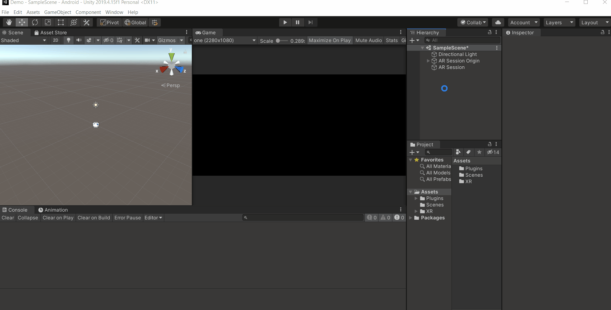

# The basic setup required to build and upload AR app/game on Play Store 

## Quick guide for downloading Dev Kits

1) Download links :
    - NDK : https://dl.google.com/android/repository/android-ndk-r19-windows-x86_64.zip
    - Gradle: https://gradle.org/releases/

2) Once its downloaded, extract the zip files and place it an your desired location.

3) Using Android Studio download the SDK for version 8.0 and above.

4) In unity go to Edit -> Preferences -> External Tool, and enter the path of the respective Dev Kits.
    - Generally for the JDK the path is going to be : D:/"SOME_LOCATION"/2019.4.15f1/Editor/Data/PlaybackEngines/AndroidPlayer/OpenJDK 
    - For NDK and Gradle the path is the location where you downloaded and extracted those files.
    - For SDK the location will be mentioned in the Android Studio. 

     

#
## Follow the below steps once you have downloaded and assigned the SDK, NDK and Gradle.

1)	Click on File -> Build Settings, this will open a Build setting window. Select the option called Android and then click on Switch Platform. Now wait for it to load.

    
#
2) Select Player Settings and make the following changes:
    -  Change the default company name to your company name.
    -  Select "Other Settings" 

        a) Remove Vulcan from Graphics API.

        b) Uncheck Multithreaded Rendering.

        c) Change Minimum API level to Android 8.0 and above 

        d) Change Scripting Backend to IL2CPP , why ? To view ARM64 architecture.

        e) Change Api Compatibility Level to .NET 4.x

        f) Check the box for ARM64 under Target Architecture.

    

    - Select "Publishing Settings"

        a) Click on Keystore Manager, select Keystore... and click on Create a new key.

        b) Select the location where you want to store the key and hit enter.

        C) Enter the password for the keystore.

        d) Enter the name of your key and password for the key and click on add key.

        e) Confirm to set the created key to the project by clicking on "Yes".

        f) [Note: this step is only if you are using unity version 2019.x, this is not required for unity version 2020] Check the box for Custom Main Gradle Template and Custom Launcher Gradle Template.

    
#
3) Click on Windows -> Package manager and install ARFoundation version 4.1.3, ARCore XR Plugin version 4.1.3.

    

#
4) Click on File -> Build Settings -> Player Settings -> XR Plug-in Management, and check the box for ARCore.

    
#
5) In the Hierarchy :
    - Select the Main Camera and delete it.
    - Right click on the Hierarchy and select XR -> AR Session Origin.
    - Select the AR Camera from the Hierarchy and change the tag as "Main Camera".
    - Right click on the Hierarchy again and select XR -> AR Session.

    
#
6) [Skip this step if you are using Unity version 2020]Editing Gradle files: 
    - Open the Gradle files mainTemplate.gradle and launcherTemplate.gradle which can be found in your project folder : Assets/Plugins/Android/
    - Delete the following lines from BOTH the files : // GENERATED BY UNITY. REMOVE THIS COMMENT TO PREVENT OVERWRITING WHEN EXPORTING AGAIN
    - Add the following code at the TOP to BOTH the files :

        buildscript 
        
        {

            repositories 

            {
                google()
                jcenter()
            }
    
            dependencies 
            {
                // Must be Android Gradle Plugin 3.6.0 or later. For a list of
                // compatible Gradle versions refer to:
                // https://developer.android.com/studio/releases/gradle-plugin
                classpath 'com.android.tools.build:gradle:3.6.0'
            }
        }

        allprojects 

        {

            repositories 
            
            {
                google()
                jcenter()
                flatDir 
                    {
                        dirs 'libs'
                    }
            }
        }

#

## That's it! Now the project is ready for development and apk can be easily built and uploaded on Play Store.

#

## Testing

1) In the Hierarchy right click, 3D Object -> Cube 

2) Reduce the scale of cube to 0.5, 0.5, 0.5

3) Drag it in Z-direction will its seen in the Game view.

4) [ Make sure your phone is connected and Debug mode is enabled and allowed on your phone ] Click on File -> Build Settings -> Add Open Scene -> Build and Run.

5) Give a name to your apk and save it.

6) Wait for the build to be completed and the app to launch in your phone.

7) After launching if you are able to see the cube and its tracked when you move the phone , all the setting are prefect and you should not have any problem 

## PERSONNEL SUGGESTION

Once you have it tested and ready, save the project and exit it.
Go to the location where you had created this project and make a copy of it and rename it as Template.
Next time if you want to create a new AR Project , juts make another copy of the template and start working directly , you will not have to do this entire process again!! 