# How to setup Unity for HTC Vive

The steps mentioned in section 1 and 2 of this blog is taken from this [YouTube tutorial](https://www.youtube.com/watch?v=ZiP99YW2JIQ). If you have XRInteraction Toolkit and the XRController setup already , jump to section 3 which shows how HTC Vive can be used with the OpenXR plugin.

Note: The only difference here is that, I am using the latest version of unity 2020.3.1f1 and choosing template as URP instead of 3D.

## 1. Downloading XRInteraction package
This section covers downloading and importing XR Interaction Toolkit into unity.

1. Open unity hub and create and new Project, I am calling it "Hello VR. It's better to use the Universal Render Pipeline as the template, because the graphics will look better when its build onto a headset, however you can choose 3D as well.

    

2. Unity will open with a default scene, but we will create a new scene for us to work in. For that, select the scene folder in Project window, right click Create -> Scene, rename it and double click on it to open the new scene. 
    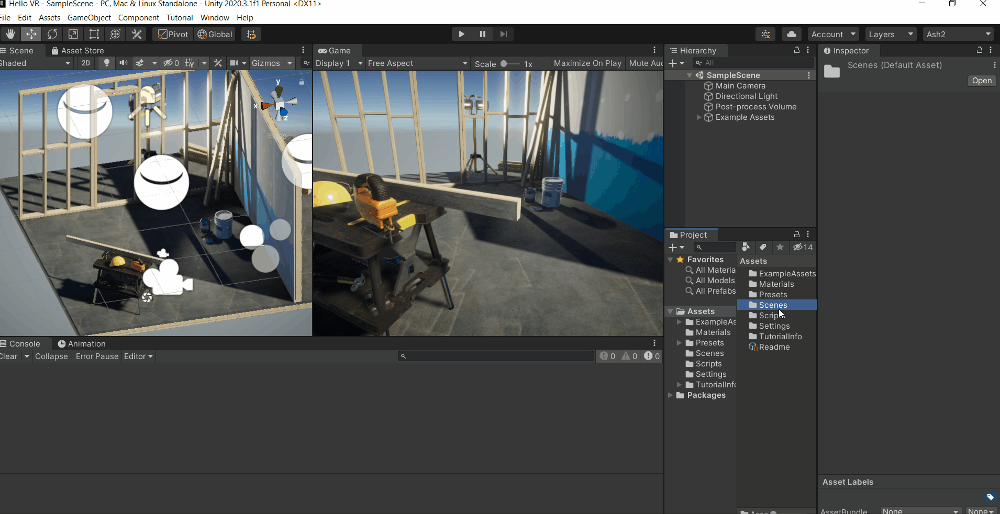

3. Click on Windows -> Package Manager -> select the setting icon ⚙ -> Advanced Project Setting -> Check the box for "Enable Preview Packages" and select "I understand". It’s just a warning that it’s a preview package and not yet released so it could potnetially have bugs.
    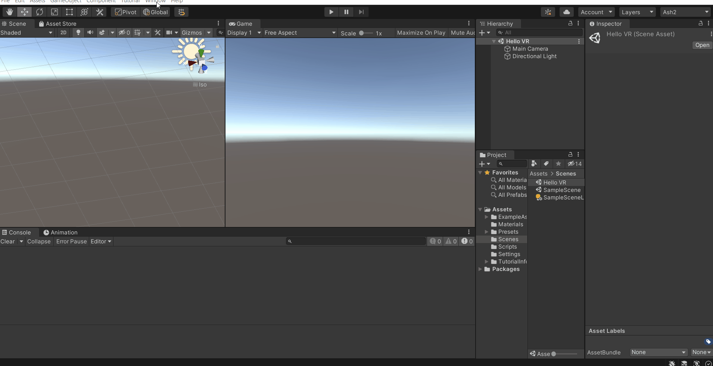

4. Select Unity Registry from the dropdown -> search for "XR Interaction Toolkit" or scroll down to find it. Select that package -> Click on "See other versions" -> select 1.0.0-pre.3 and install it. After installing a window will popup asking you to restart unity, click on "Yes" to continue.

    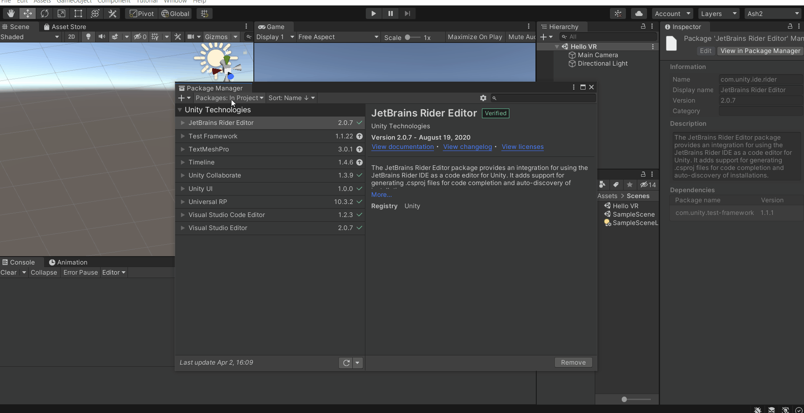

    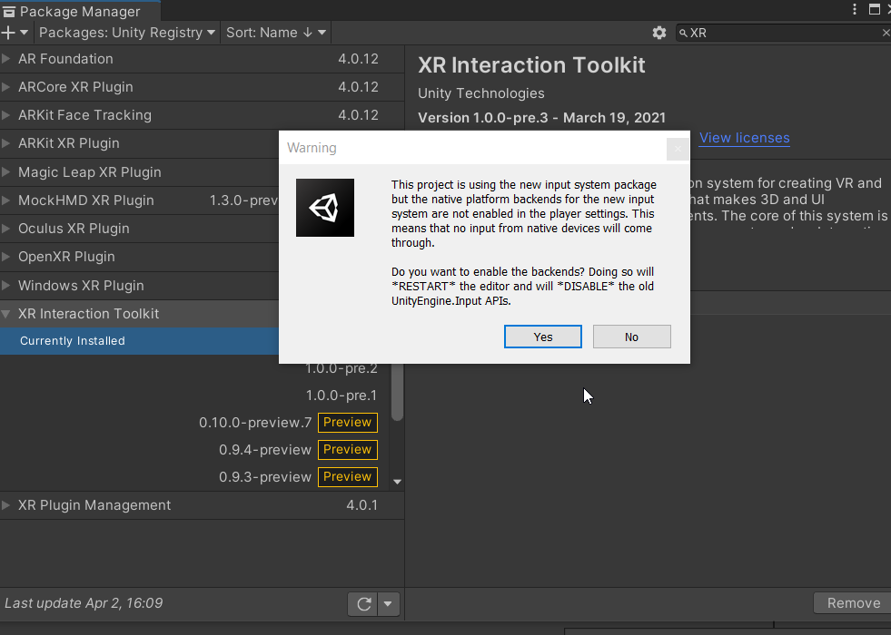

5. After Unity reopens, select the package from package manager. Import "Default Input Action" and "XR Device Simulator"
    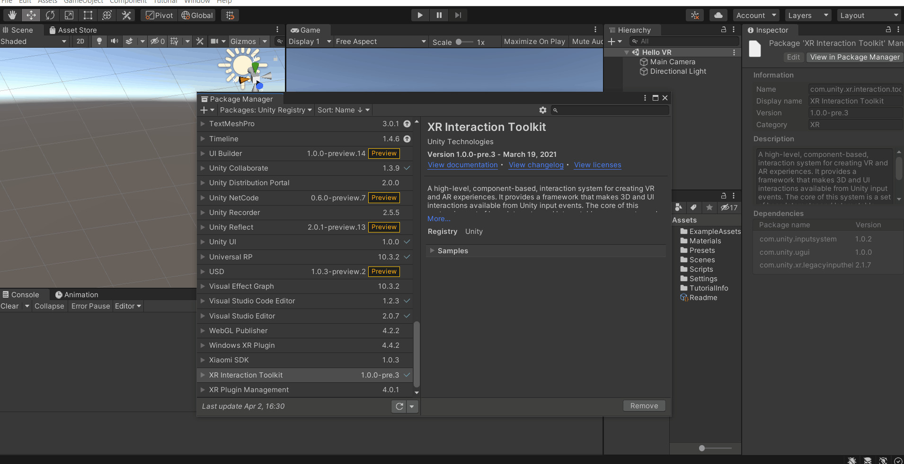

This concludes the initial setup of unity. We will now setup the XR rig and other components to enable us to use VR controllers.

## 2 Setting up XR Interaction toolkit

In this section we will setup the XR rig and the default key bindings. We have the option to manually assign it but that is tedious process and time consuming. So to begin with its recommended to use the default setting and then you can use custom controls.

1. In the Project window navigate to Samples -> XR Interaction Toolkit -> 1.0.0-pre.3 -> Default Input Actions. Here select "XRI Default Left Controller" and from the inspector window click on "Add to ActionBasedController default ". Next, select "XRI Default Right Controller" and perform the same action once again.
    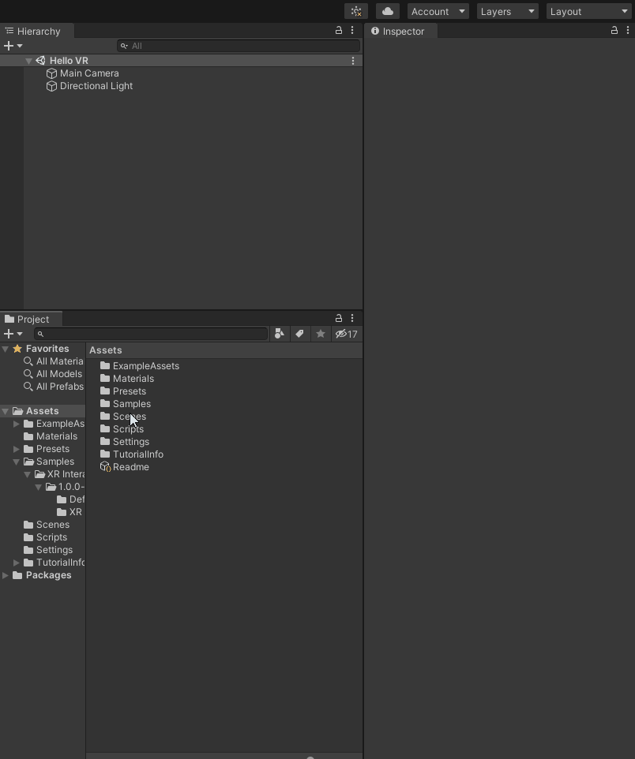

2. To make sure we get the default values as preset, select File -> Build Settings -> Player setting -> Preset manager, under ActionBasedController type the filter "Left" and "Right" for the respective presets.
    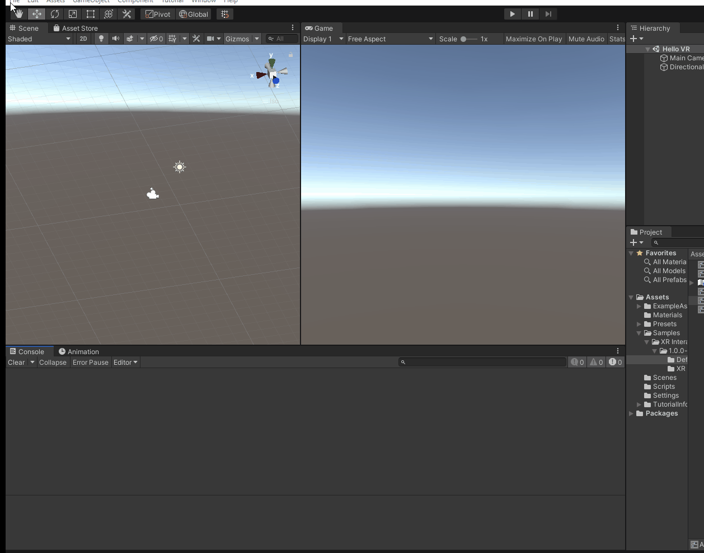

3. Delete the Main camera from the Hierarchy. Right-click -> XR -> select "Room Scale XR Rig (Action-Based) ". If you open the child of the XR Rig you will notice that it has Left and Right controllers with the default values.
    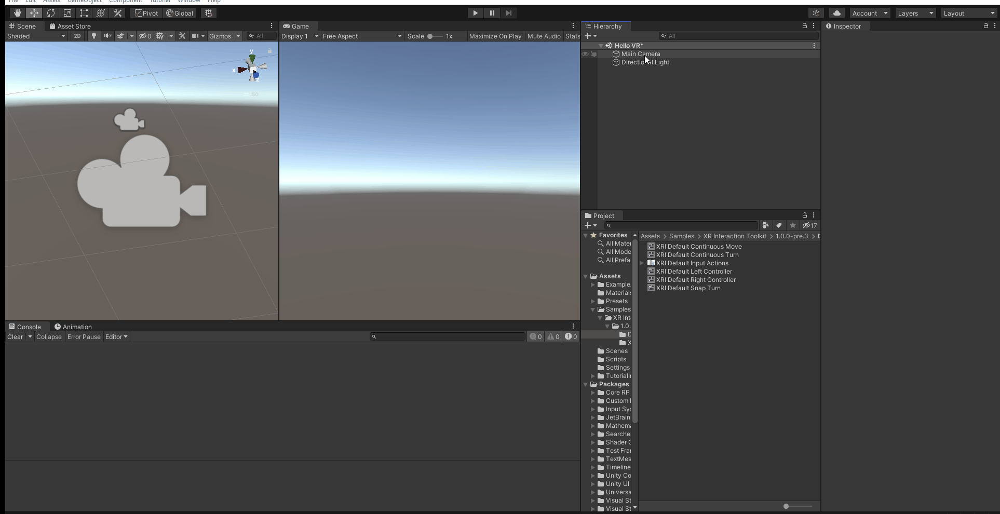

4. Select the XR Rig game object and add the component "Input Action Manager" and change the action assets to 1. In the project window navigate to Samples -> XR Interaction Toolkit -> 1.0.0-pre.3 -> Default Input Actions. Select the "RXI Default Input Actions", drag and drop it in the Input Action Manager component. 
    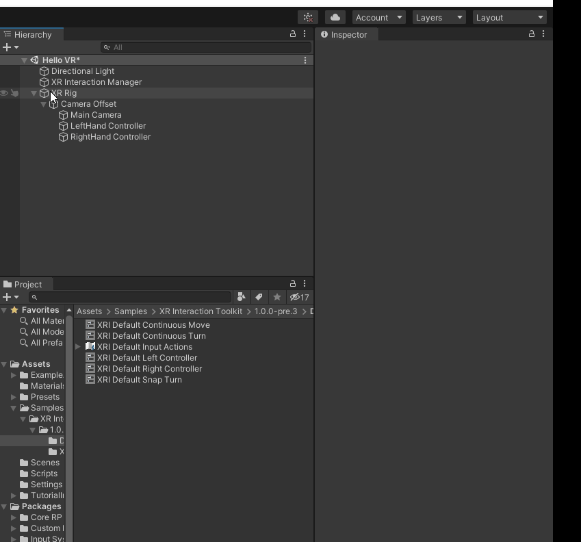

5. Add a 3D plane to mark the play area, it’s not necessary but its helps in visualization.
    

This completes the basic setup for developing VR projects. The next section shows the setup of OpenXR

## 3. Setting up OpenXR Plug-in
OpenXR plugin was released recently for Unity version 2020, before that developers had to use the older Unity version for it to be compatible   with HTC vive. 

1. Click on Windows -> Package Manager -> Install OpenXR plugin
    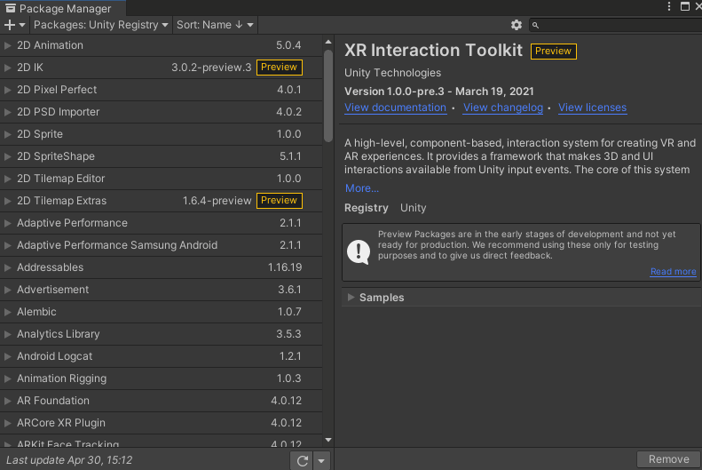
2. Go to file -> Build settings -> Player settings -> XR Plug-in Management and check the box ☑ for OpenXR.
    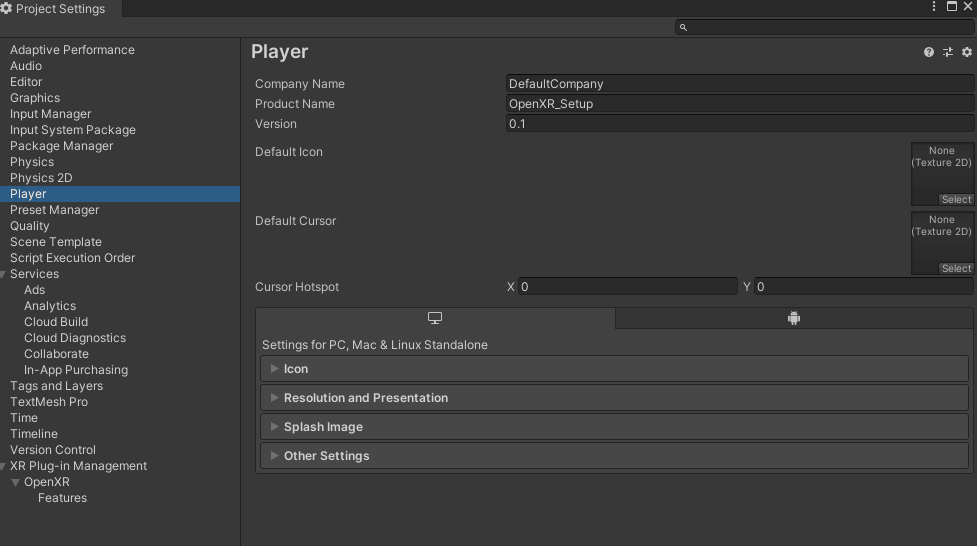
3. In the same window, click on features under OpenXR and check the box ☑ for HTC Vive Controller Profile. 
    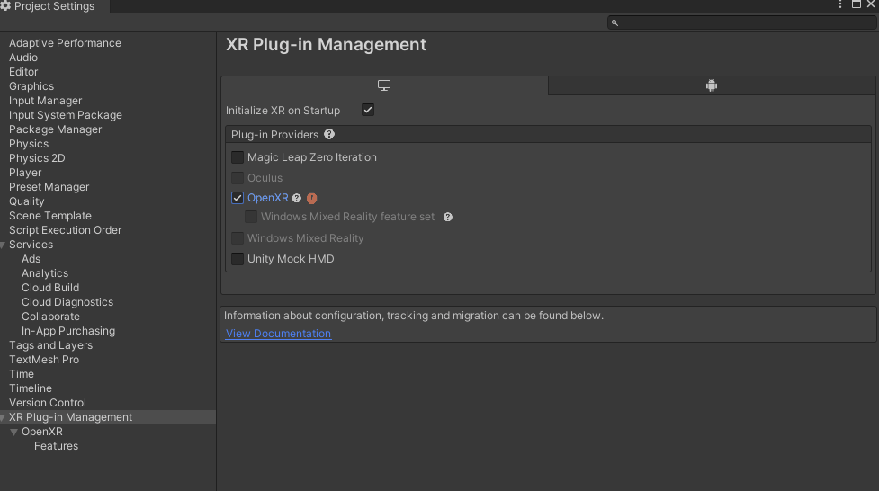

    Note : If you scroll down in the list of features, there is an option of Valve index. I haven't tested that, but if you are using an Index do check that out. It should definitely work.
    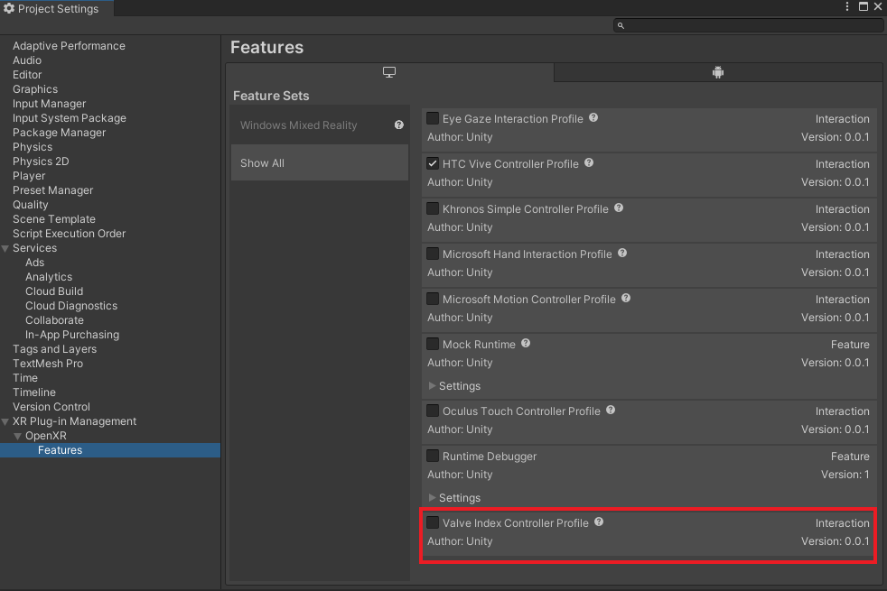
4. The last step is to fix few setup errors. Select the XR Plug-in Management-> Click on the exclamation mark -> Select the option fix all
    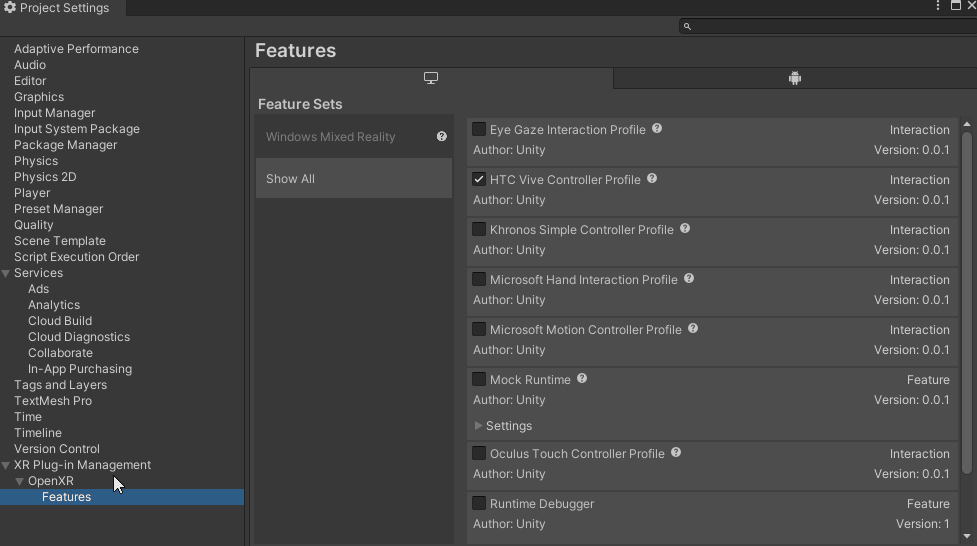

With that done, HTC vive and its controllers can now be used to interact with the object in the scene inside of plat mode in Unity.

-Ashray H Pai

Teleportation in real world is considered as a science fiction, but I would say otherwise.Even though you cannot physically teleport from one place to another, you can do it virtually and this is why I love immersive technologies.
Various experiences like playing sports, travelling, flying a plane,etc cannot be physically experienced by all and I always had the passion to bridge this gap using the latest technologies.

Find me on:

[Discord Channel](https://discord.gg/rWxZvxEu)

[GitHub](https://github.com/ashraypai)

[LinkedIn](https://www.linkedin.com/in/ashray-pai-06a53513a)

[YouTube](https://youtube.com/playlist?list=PLlzEaSubsR5lKOaclT2E4LSfBqLFmkSIs)

