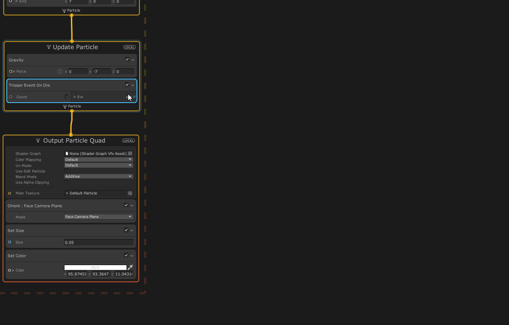

# In this blog I try to capture the setup and usage of Postprocessing along VFX graph to make fireworks in AR

###  I have setup the VFX graph 1st and then the post processing to show the difference postprocessing makes.
We will first create a simple system where a particle spawns that represent a rocket launching. Then add post processing to make it look realistic and finally get back to VFX graph to create the Fireworks.    
#
## Setting up VFX Graph

1) Install the Visual Effect Graph from the Package Manger.

    

2) Right click on your Project and Create a Visual Effects -> Visual Effect graph, and name it as Fireworks

     

3) Double click this to open the VFX editor. You will have a default system in the editor. Also the blocks like "Spawn", "Initialize Particle", "Update Particle", etc. that you see are called as nodes. These nodes have various components that provide functionality to the particles

     

4) Make the following changes to your default graph:

    a) In the spawn node, change the Spawn rate to 1 , so that we have one particle every 1 second
        

    b) In the initialize particle node:
    - We want the particle to shoot up, so under the "Set velocity Random" component change the 'y' values to 14.
    - We want it to disappear after a second, so under "Set Life Random" component change the values to 1 and 1.2.
        

    c) With this, the particle now keeps shooting up and to make it realistic we need to add a gravity component. Select the update node, hit the space bar which will open a search menu. Search for gravity and hit enter
        

    d) Last step is to change the way the particles look. So make the following changes in the output node:
    - Change the blend mode from alpha to additive.
    - Change the Main Texture to default particle.
    - We want our particle to have the same size throughout,so select the component "Set Size over Life" and delete it. Hit the space bar , search "Set Size" and enter the value as 0.05
    - We want the color to be constant as well, so select the component "Set Color over Life" and delete it.Hit the space bar , search "Set Color" and select the color you want. Also increase the intensity to 7.
    
     
    
      
     
     

5) Now your particles should look something like this:

     
)

## Setting up Post Processing

1) Install the Post Processing Package from the Package Manager.

     

2) Right click on your Project and Create a Post Processing profile, in this case we are creating a Bloom Effect and hence I named it as BloomEffect.

     

3) To add the Bloom effect, Select the PostProcessing Profile and click on Add effect -> Unity -> Bloom. 

     

4) For us to see the bloom effect we need to create an empty game object and add a component called Post-Process Volume

     

5) The Post-process volume component requires a profile, which we have already created, so just drag and drop it to the Post-process layer component.

     

6) For this GameObject with Post-process volume , the layer has to be changed and so we will create a new layer called 'PostProcessing'. After creating it, make sure to go back and select it from the dropdown. 

     

7) Now Under the Post-process Volume ,Check the box for  "Is Global" and "Intensity". Set the value of intensity to your desired value, I have set it to 3 also rename the GameObject as "BloomEffectLayer".
     

8) For the effect to be seen , a post processing layer has to be added to the main camera. And change the layer to "PostProcessing"

     
     

9) Thats it! Your rocket should be glowing now.
     

#
## Here is a side to side comparison with and with out Post Processing 

Yes ! for some reason in the sene view there is no change seen.
    
    

#
## Continuing with the Firework effects

To create the rocket explosion follow the below steps

1) Select the Fireworks VFX Graph, Update node and add the component called "Trigger Event on Die" and set the count to 1000 (this is number of particles that will get instantiated once it dies)
     

2) Drag from the event node, and popup will be seen to create a node.
    - Select "Context" -> "GUP Event". From this point we will call this the explosion graph.
    - Drag from the GPU Event and select the "Initialize Particles".
    - Drag from the Initialize Particles and select the "Update Particles"
    - For creating "Output Particles", copy from the existing graph can paste it at the side , then connect the Update and Output nodes.

    

3) From the explosion graph,

    a) Select the Initialize Particle node and follow the below steps:
    - Increase the capacity to 1000.
    - Add a component called "Set Lifetime Random" and enter the values 1.5 and 3. This will randomly assign the life of particles to 1.5 to 2 seconds.
    - The explosion should occur at the top where the rocket particles die, to achieve that add a component called "Inherit Source Position"
    - In Order to scatter the particles add the component called "Add Velocity from Direction & Speed (Random Direction)" . Select the speed mode to random -> enter the values 5 and 6.
            

    b) Select the Update Particle node and follow the below steps:
    - To simulate the resistance of air, add the component called "Liner Drag" and set the value to 3/
    - To simulate gravity add the component called "Gravity " and set the value to -1.
            

    c) Select the Output Particle node and follow the below steps:
    - We want the size and color to vary, so delete the set size and set color components. Add the components called "Set Size Random" and "Set Color over life".
    - For the component Set Size Random enter the values 0.03 and 0.05
    - For the component Set Color over life , click on color, which will open a popup menu. Use this to adjust the colors according to your need. 
    - The top bar in the popup menu is the alpha value and down bar is to assign colors. Every time you assign a color, make sure to increase the intensity in order to visualize the bloom effect. In order to get that flash when the explosion happens, choose the 1st color and increase the intensity to max.
        
        

4)  Our firework effect is finally ready !
