# How to set up unity to run XR Device Simulator for your VR Project 

One can develop and test VR project without having a headset. This is possible by using the XR Device Simulator which comes with the XR Interaction Toolkit.

## First steps
The steps mentioned in this section and the section after this is explained in this [YouTube tutorial](https://www.youtube.com/watch?v=ZiP99YW2JIQ)

Note: The only difference is I am using the latest version of unity 2020.3.1f1 and choosing template as URP instead of 3D

1. Open unity hub and create and new Project, I am calling it "Hello VR. It's better to use the Universal Render Pipeline as the template, because the graphics will look better when its build onto a headset, however you can choose 3D as well.

    

2. Unity will open with a default scene, but we will create a new scene for us to work in. For that, select the scene folder in Project window, right click Create -> Scene, rename it and double click on it to open the new scene. 
    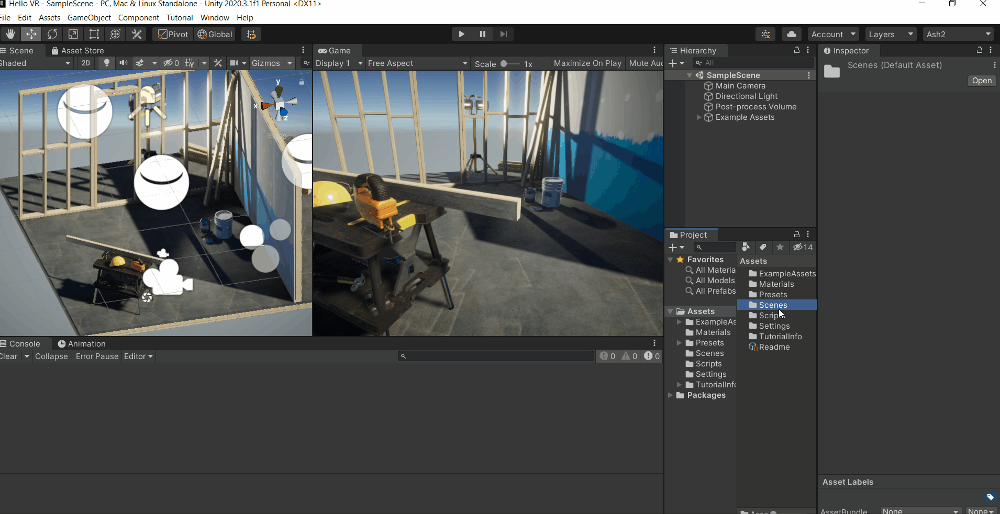

3. Click on Windows -> Package Manager -> select the setting icon ⚙ -> Advanced Project Setting -> Check the box for "Enable Preview Packages" and select "I understand". It’s just a warning that it’s a preview package and not yet released so it could potnetially have bugs.
    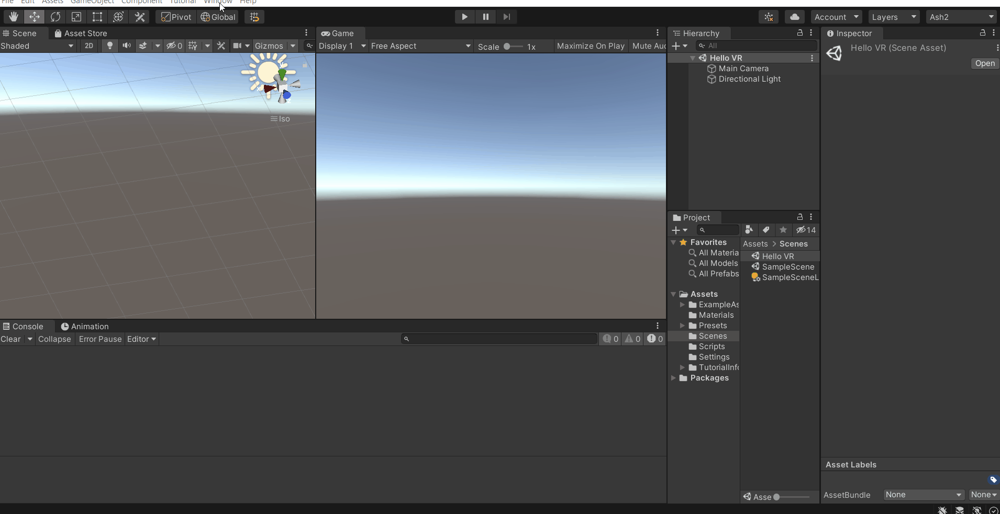

4. Select Unity Registry from the dropdown -> search for "XR Interaction Toolkit" or scroll down to find it. Select that package -> Click on "See other versions" -> select 1.0.0-pre.3 and install it. After installing a window will popup asking you to restart unity, click on "Yes" to continue.

    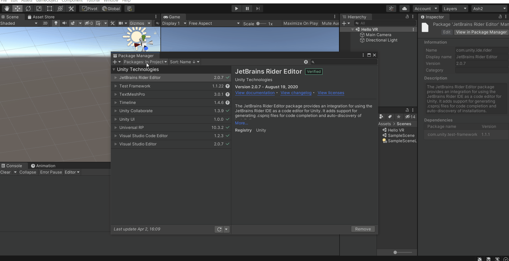

    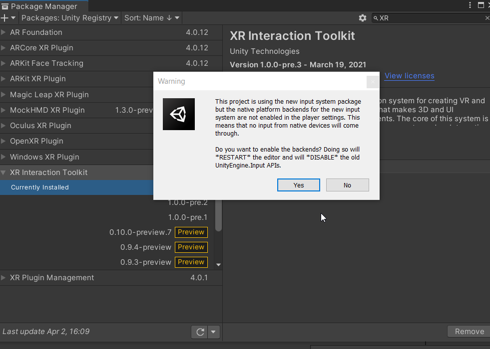

5. After Unity reopens, select the package from package manager. Import "Default Input Action" and "XR Device Simulator"
    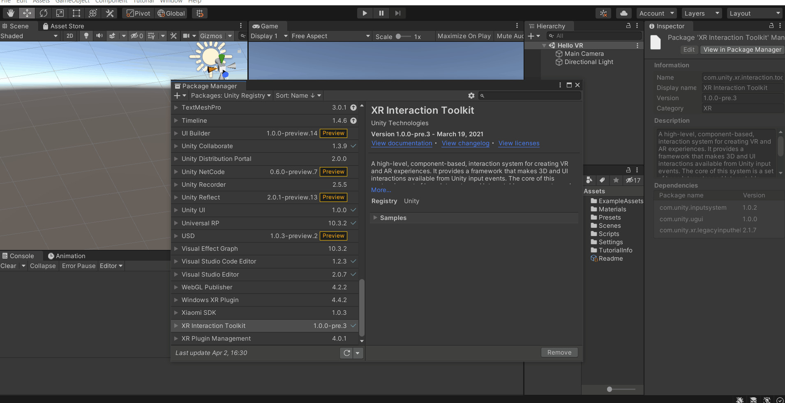

This concludes the initial setup of unity. We will now setup the XR rig and other components to enable us to use simulate VR controller using keyboard and mouse.

## Setting up XR Interaction toolkit

In this section we will setup the XR rig and the default key bindings. We have the option to manually assign it but that will be time consuming.

1. In the Project window navigate to Samples -> XR Interaction Toolkit -> 1.0.0-pre.3 -> Default Input Actions. Here select "XRI Default Left Controller" and from the inspector window click on "Add to ActionBasedController default ". Next, select "XRI Default Right Controller" and perform the same action once again.
    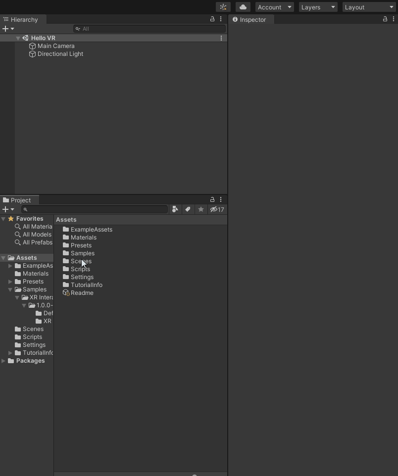

2. To make sure we get the default values as preset, select File -> Build Settings -> Player setting -> Preset manager, under ActionBasedController type the filter "Left" and "Right" for the respective presets.
    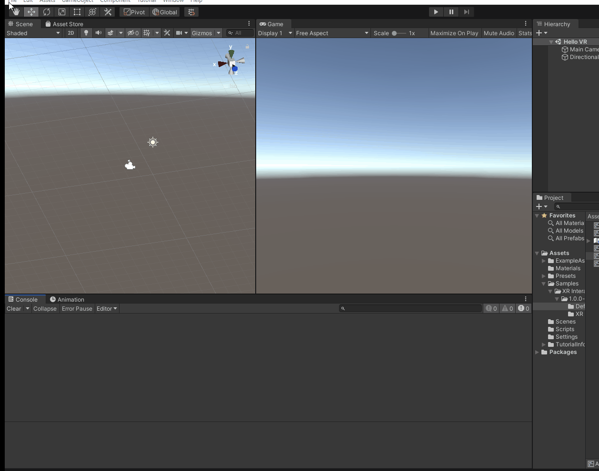

3. Delete the Main camera from the Hierarchy. Right-click -> XR -> select "Room Scale XR Rig (Action-Based) ". If you open the child of the XR Rig you will notice that it has Left and Right controllers with the default values.
    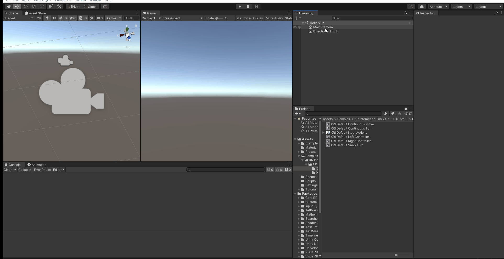

4. Select the XR Rig game object and add the component "Input Action Manager" and change the action assets to 1. In the project window navigate to Samples -> XR Interaction Toolkit -> 1.0.0-pre.3 -> Default Input Actions. Select the "RXI Default Input Actions", drag and drop it in the Input Action Manager component. 
    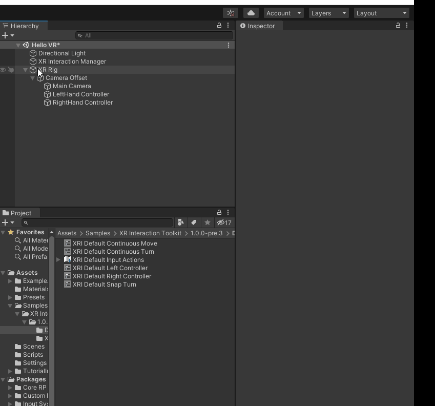

5. Add a 3D plane to mark the play area, it’s not necessary but its helps in visualization.
    

6. The last part is adding the simulator. To do this, in the project window navigate to Samples -> XR Interaction Toolkit -> 1.0.0-pre.3 -> XR Device Simulator. Drag the "XR Device Simulator" game object from here and drop it int the scene.
    

This completes the basic setup for developing VR projects without headsets. In the next section we will see the keyboard and mouse equivalent of the controllers

## Using controls in the simulator

- For better visualization and understanding download this [XR-Interaction-Toolkit-Examples](https://github.com/Unity-Technologies/XR-Interaction-Toolkit-Examples) from github.
    1. Open unity hub, add the project 'VR' and open it in unity. 
    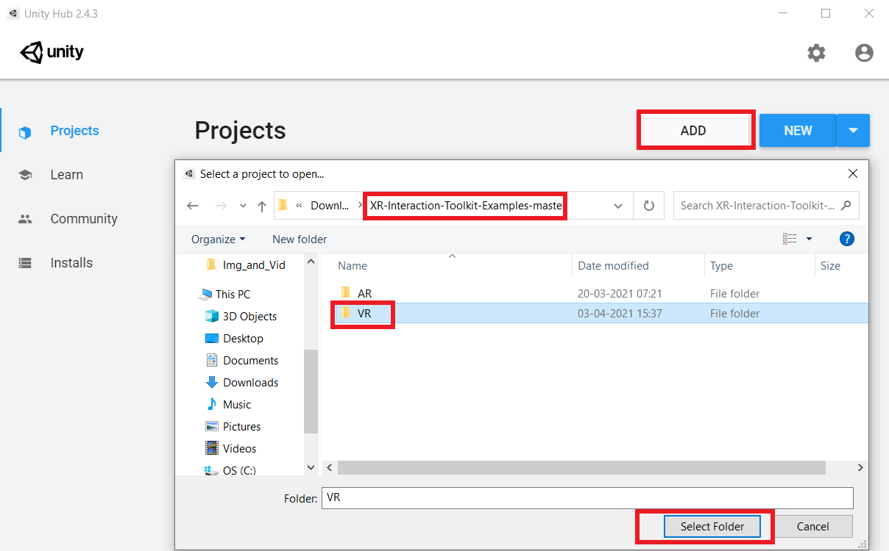
    2. In the project window select Scenes and double click on "WorldInteractionDemo"
    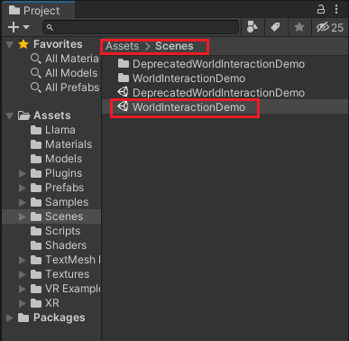

Now we can move on to learn the key bindings.
 
 1. To look around  
 
